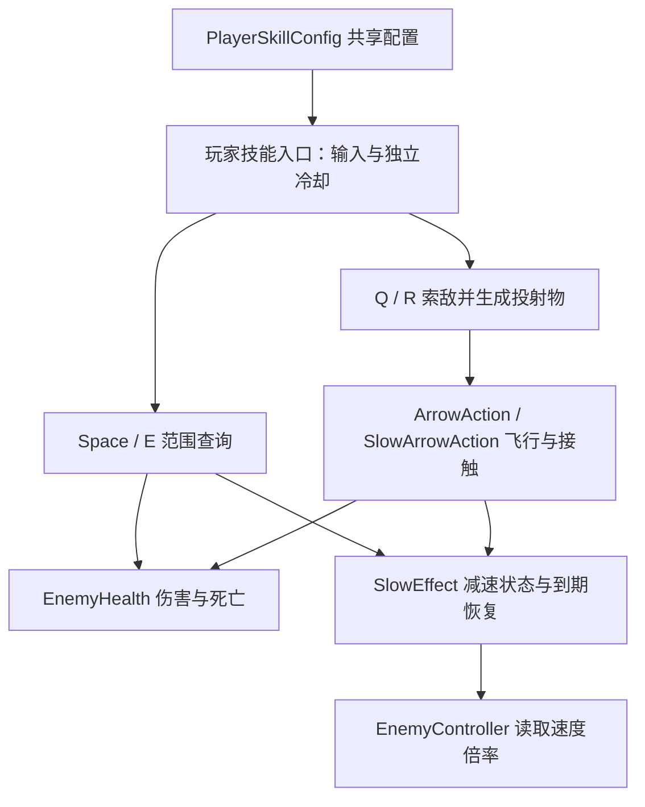

# Combat：当前实现与下一步取舍

2026-09-22，代码基线 `5e8efd8`。本文由 AI 根据代码与作者复盘整理；作者已认可组件组合方向。下文的重构方案尚未实施。

## 当前调用链

| 入口 | 执行流程 | 主要规则 |
|---|---|---|
| Space / PlayerAttack | 范围查询 → EnemyHealth.TakeDamage | 开局等待一次冷却；空放消耗冷却 |
| Q / PlayerShoot | 查询最近存活敌人 → 确定方向 → 生成并初始化 ArrowAction → 接触时扣血 | 无目标不消耗冷却；直线飞行、不追踪 |
| E / SlowSkill | 范围查询 → 对每个存活敌人扣血 → 仍存活且有 SlowEffect 时施加减速 | 空放消耗冷却；不要求目标持续留在范围内 |
| R / PlayerSlowShoot | 查询最近存活敌人 → 生成并初始化 SlowArrowAction → 接触时扣血并尝试减速 | 当前命中分支要求目标同时有 EnemyHealth 和 SlowEffect |

R 在玩家存活时发射减速弹，死亡后由独立的 PlayerRestartController 处理重开。PlayerHealth 死亡时逐个停用玩家输入/技能组件；已经发射的弹体继续自己的生命周期。

图中都是现有职责；DamageEffect、统一 SkillRunner 和通用 Buff 集合尚未实现。两类 Health 实现 IDamageable，但当前攻击代码仍通过具体 Health 筛选和调用。接口只约定受伤能力，不表达阵营或是否存活。

## 状态归属

| 数据或状态 | 所有者 | 生命周期 |
|---|---|---|
| 伤害、范围、基础冷却 | PlayerSkillConfig 资产 | 共享设计参数；入口初始化时读取 |
| 剩余冷却 | 每个技能组件 | 独立计时，不写回配置资产 |
| 方向、速度、起点、最大距离、伤害及附加减速参数 | 每枚投射物 | 生成后初始化，弹体销毁时结束 |
| 当前生命与死亡 | 每个 Health 组件 | 目标实例持有 |
| 减速倍率、剩余时长 | 每个敌人的 SlowEffect | 重复施加覆盖倍率并刷新时间；到期恢复为 1 |
| UI 更新 | HealthChanged 的表现层订阅者 | 不由命中效果直接操作 UI |

SlowEffect 在 FixedUpdate 中递减计时，无剩余时间则立即返回。自然到期先恢复倍率，再通知 Expired；禁用时清空状态，不发送自然到期通知。详见[范围减速](area-slow.md)。

## 扩展实验暴露了什么

DAY_27 的减速弹复用了 SlowEffect，未重写敌人移动和效果计时；但新增了 PlayerSlowShoot 与 SlowArrowAction，复制了大量索敌、冷却、飞行和碰撞判断。提交 `5e8efd8` 涉及 11 个文件、459 行新增和 1 行删除，包含资产及 meta，不能把全部行数当成新增业务代码。

新增类型曾遗漏玩家死亡停用和其他投射物的忽略判断，后续已修复。当前普通弹与减速弹仍相互枚举具体类型，下一种弹体可能再次需要修改旧类型。

还有两项保留限制：发射入口的配置保护不一致；SlowArrowAction 把伤害与 SlowEffect 是否存在绑定。缺少 SlowEffect 的 EnemyHealth 目标不会在当前分支受伤，通常进入障碍销毁分支。该行为尚未修改。

## 已认可、尚未实施的方案

采用组件组合，先统一弹体，再处理发射侧重复。以下名称是拟议名称：

| 拟议组件 | 职责 |
|---|---|
| ProjectileMotor | 方向/速度初始化、移动、超距清理；同时可作为弹体识别组件 |
| ProjectileHit | 目标与障碍筛选、明确的结算顺序、命中后清理 |
| DamageOnHit | 对选中的目标调用受伤能力 |
| SlowOnHit | 对仍存活且有 SlowEffect 的目标施加减速 |

普通弹 Prefab 使用前三个组件；减速弹再增加 SlowOnHit。ProjectileHit 显式持有必需伤害组件及可选减速组件，按“伤害 → 重新检查存活 → 可选减速 → 请求销毁”调用，不依赖 Inspector 中组件排列或多个物理回调的执行顺序。方向和伤害等参数仍由发射方初始化到每枚弹体。

这个方案增加组件和 Prefab 连接检查，但能让两种弹共用飞行与命中筛选。保留两套实现的迁移成本最低，却会继续承担同步修改；基类也能复用飞行，但容易把命中差异和生命周期扩展都压进继承关系。作者认可组合方向；具体契约仍需在实施前核对。

首个切片预计涉及两个 Arrow 脚本、拟议组件、两个发射入口的初始化调用、普通/减速弹 Prefab 及对应 meta。保存既有资产 GUID，并检查 TestArena 引用。发射入口暂时分别保留，后续再评估共用 ProjectileLauncher 和目标查询。敌人 SlowEffect 独立计时继续保留；死亡停机逐个识别技能的耦合也暂时保留。

迁移应保持：Q/R 输入、独立冷却、无目标不发射、直线飞行、碰墙/超距销毁、普通弹不减速、致死后不施加 Slow，以及同一物理步多个目标接触允许分别结算。伤害不再依赖 SlowEffect 是一项明确的行为修正，需单独验证。不能顺手加入 hasHit 改变既有多目标规则。

验证范围：编译、Prefab/scene 引用、普通/减速弹对照、无 SlowEffect 目标、致死命中、重复减速与到期恢复、投射物相互忽略、墙/距离清理、玩家死亡及重开。迁移前后使用相同参数；高速薄墙和多 Collider 仍需专项证据。

## 性能判断与证据边界

当前每个敌人一个 SlowEffect，每个物理步做常数次工作，n 个实例合计 O(n)。未来若每个实体平均逐个更新 b 个效果，朴素模型是 O(n×b)；当前没有这样的效果集合。最近目标筛选在释放时扫描物理查询返回的候选，不能把它与效果更新凭空算成嵌套循环。

这些是代码成本模型，不是耗时测量。没有 Profiler 证据说明 SlowEffect 是瓶颈，因此保留现有计时方式。范围查询、分配和 Instantiate/Destroy 可在压力测试时测量，再决定优化目标。

DAY_27 有作者确认的修复后运行结果和 C# 编译 0 warning / 0 error 记录；AI 未独立覆盖全部 Play Mode 场景。DAY_28 只整理文档、核对代码和确定方向，没有新增运行、自动化测试或性能结果。普通投射物的详细限制见[实现说明](player-projectile.md)，历史架构选择见[DAY_22 方案](combat-architecture-options.md)。
