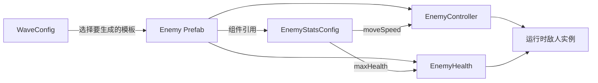

# Data-Driven Enemy Configuration

## 目标

敌人的基础数值不直接写死在控制逻辑中，而是保存在 `EnemyStatsConfig` 资产里。这样可以在不修改 C# 的情况下创建数值不同的敌人变体，同时继续复用已有的移动、接触伤害、受击和死亡逻辑。

目前配置包含：

- `moveSpeed`：敌人的追踪速度。
- `maxHealth`：敌人的最大生命值。

## 数据流

`WaveSpawner` 按顺序读取 `WaveConfig`，再实例化其中引用的敌人 Prefab。Prefab 保存完整的组件组合，并让 `EnemyController` 和 `EnemyHealth` 引用同一份 `EnemyStatsConfig`。

实例初始化时：

- `EnemyController.Awake()` 从配置读取 `moveSpeed`。
- `EnemyHealth.Awake()` 从配置读取 `maxHealth`，然后为当前组件实例初始化独立的 `currentHealth`。

## 数据、逻辑、表现与运行状态

| 类别 | 当前项目中的位置 | 职责 |
|---|---|---|
| 静态配置数据 | `EnemyStatsConfig.asset` | 保存可以由设计者调整并被多个对象共享的速度和最大生命 |
| 生成配置 | `WaveConfig.asset` | 保存敌人数量、敌人 Prefab 和同一波内的生成间隔 |
| 逻辑 | `EnemyController.cs`、`EnemyHealth.cs`、`ContactDamage.cs` | 执行追踪、生命管理、接触伤害和死亡行为 |
| 对象模板与表现 | Enemy Prefab | 保存组件组合、配置引用，以及 SpriteRenderer 等表现设置 |
| 运行实例状态 | 每个 `EnemyHealth.currentHealth` | 保存单个敌人当前剩余生命，不写回共享配置 |

多个敌人可以引用同一份配置，但它们拥有不同的 `EnemyHealth` 组件实例。因此一只敌人受到伤害时，只会改变该实例的 `currentHealth`，不会改变配置中的 `maxHealth`，也不会直接改变其他敌人的当前生命。

## HeavyEnemy 扩展示例

本次新增了第三种敌人变体：

| Variant | Move Speed | Max Health | 用途 |
|---|---:|---:|---|
| HeavyEnemy | 1.2 | 420 | 用较慢移动速度和较高耐久形成与已有敌人的可观察差异 |

扩展过程只涉及 Unity 资产：

1. 创建 `HeavyEnemyConfig.asset`。
2. 创建 `HeavyEnemy.prefab`。
3. 将 Prefab 上的 `EnemyController` 和 `EnemyHealth` 指向同一份 HeavyEnemy 配置。
4. 让 `Wave3.asset` 引用 `HeavyEnemy.prefab`，并设置第三波数量与生成间隔。

没有修改任何 `.cs` 文件。保存后的第三波配置生成 7 个 HeavyEnemy，生成间隔为 1 秒。运行验证中，Console 显示 HeavyEnemy 使用 `420` 最大生命，并在全部敌人清除后输出 `All waves completed!`。

## 为什么不能只创建 Config

`EnemyStatsConfig` 只是一份数据，不是可以直接放入场景的完整敌人。`WaveSpawner` 使用 `Instantiate` 创建的是 GameObject，因此 `WaveConfig` 必须引用包含组件、碰撞体、SpriteRenderer 和配置引用的 Prefab。

这意味着“不改代码新增敌人”仍然存在工程成本：需要创建资产、连接引用、选择波次、保存 `.meta`，并验证行为和 Git diff。配置化减少的是重复逻辑和代码修改，不会消除资产管理与测试。

## 当前边界

- `EnemyStatsConfig` 当前只覆盖速度和最大生命；接触伤害与表现仍由 Prefab 上的其他组件字段保存。
- ScriptableObject 用于共享静态配置，不负责保存单局中的当前生命或其他临时状态。
- 当前规模下，一个敌人 Prefab 同时引用同一配置的两个消费者足够直接；若字段和消费者继续增长，再根据真实耦合决定是否拆分配置，暂不提前增加抽象。
- 运行时直接修改共享配置可能同时影响后续读取该资产的对象，因此单局状态应保存在组件实例中，而不是写回配置资产。

## 验证清单

- HeavyEnemy 的两个配置引用都指向 `HeavyEnemyConfig.asset`。
- `Wave3.asset` 持久引用 `HeavyEnemy.prefab`。
- HeavyEnemy 以 1.2 的速度和 420 最大生命运行。
- 玩家可以攻击并销毁 HeavyEnemy，第三波能够正常结束。
- 原有移动、攻击、玩家受伤、Health UI、死亡和重开流程保持正常。
- Git diff 中没有 `.cs` 文件变化，且新 Unity 资产均保留对应 `.meta`。
